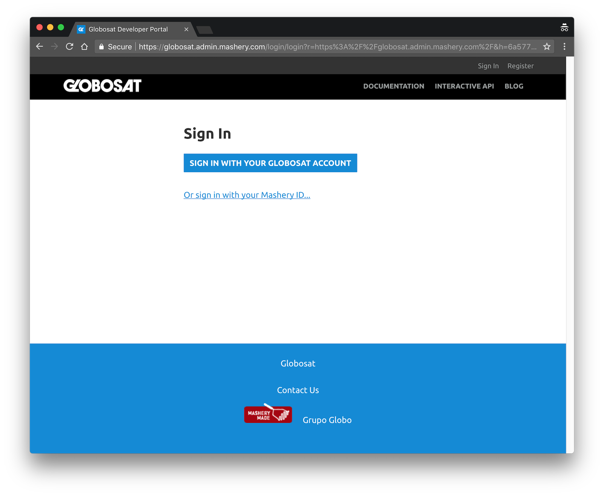
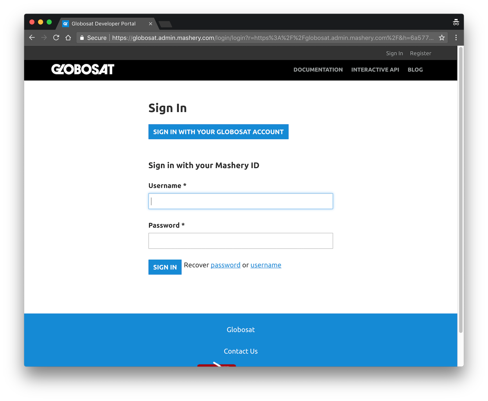

# modifySSOSignin.js

Modify the sign in page for single sign on implementations to make SSO the primary focus and hide the mashery sign in behind an expand toggle.

**The Default View**

**With the Mashery form expanded**

## Getting Started

### 1. Include the script in your Portal.

Add the script under `Manage > Portal > Portal Settings`. You can either add it as an external script or inline the code.

### 2. Initialize the script.

Call `modifySSOSignin()` in the inline footer JavaScript area (we need it to run after the form has loaded).

### 3. Add the CSS.

If you want to hide the "Register" and "What is Mashery?" sections, also add the sso.css file content. You can do this under `Manage > Portal > Portal Settings`, either inline or as an external file.