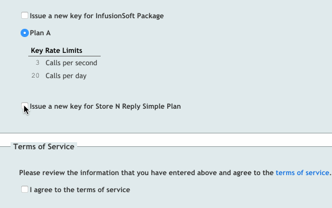

# removeMasheryApiSelection.js

Overrides and removes `MasheryApiSelection.js`, which causes the last plan on the registration to be collapsed until checked when using combined registration.

## Getting Started

Add the script under `Manage` > `Portal` > `Portal Settings`. You can either add it as an external script or inline the code. The script runs automatically and handles everything else for you.